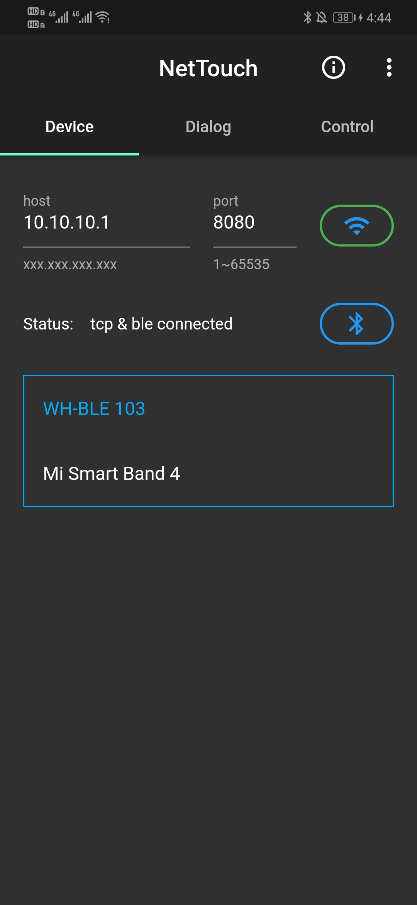
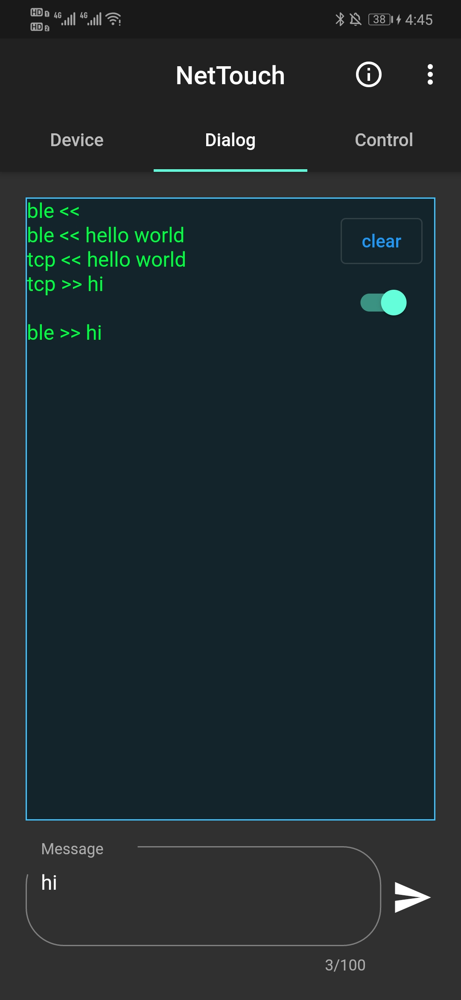
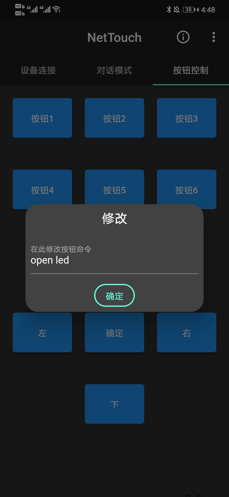

# NetTouch
A network debugging assistant based on flutter.

## Features:
1. TCP client;
2. Ble client;
3. Automatic detection;
4. Multi-language;
5. Error feedback;

## Getting Started
This project is built on flutter.  




### Build
```
flutter build apk
```
